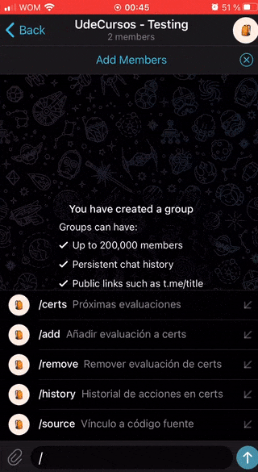
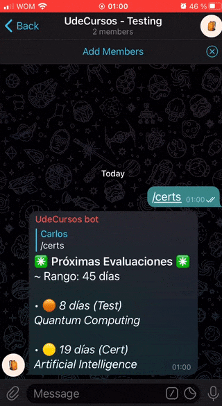
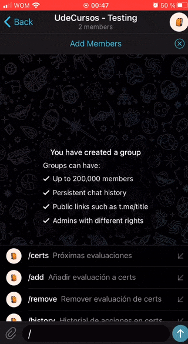

<div align="center">

  # UdeCursos-bot

  
  

  > @UdeCursosBot version: 2.0

  Bot de Telegram con automatizaciones que te hacen la carrera más fácil.

</div>

---

<div align="center">

  ### Visualiza la cuenta regresiva de tus próximas evaluaciones.

  

  ### Cualquiera puede colaborar con las fechas de evaluaciones gracias a los cómodos botones de la interfaz.

  <div style="display: flex; justify-content: space-around;">
    
    
  </div>


</div>

## Para desarrolladores

Usar el ambiente virtual de Poetry para mantener un monitoreo de las dependencias y las últimas actualizaciones de la API de Telegram.

1. Instalar [Poetry](https://python-poetry.org/docs/#installation)  con tal de instalar de manera correcta las dependencias y sus versiones.

2. Instalar dependencias del bot:
  ```bash
  # Desde la raíz de UdeCursos-bot/
  poetry install
  ```
3. Ejecutar el bot usando 
```bash
poetry run python3 main.py
```

#### Pendientes
- [ ] Mejorar documentación
- [ ] Optimizar mensajes entre usuario y bot en `/add` y `/remove`. (Que no ocupe tanto espacio en mensajes)
- [ ] Automatizar el agregar nuevos "subjects" a `certs.json` via algun comando
- [ ] Agregar `/udecursos` y `/help` 
